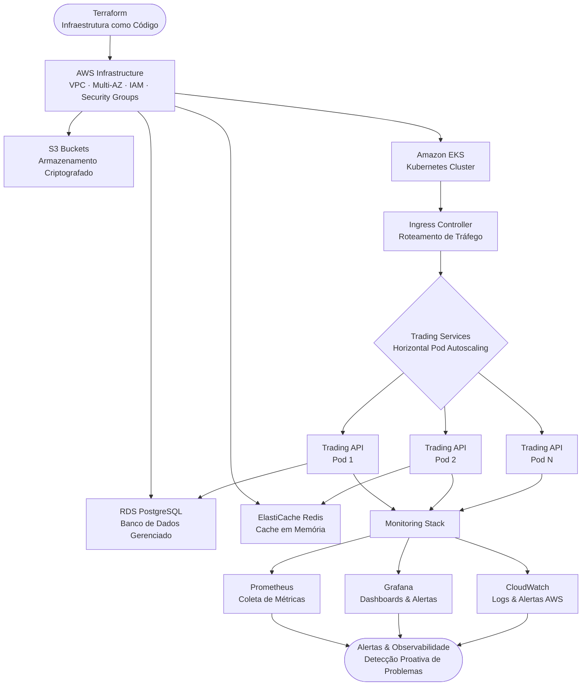

# 🚀 Trading Platform Infrastructure

[](https://www.terraform.io/)
[](https://kubernetes.io/)
[](https://aws.amazon.com/)
[](https://prometheus.io/)
[](https://grafana.com/)
[](LICENSE)

[English](#english) | [Português](#português)

---

## English

### 🎯 Overview

**Trading Platform Infrastructure** is a production-ready Infrastructure as Code (IaC) solution for deploying a high-availability trading platform on AWS. Built with Terraform, Kubernetes, and modern DevOps practices, this repository provides complete infrastructure automation, monitoring, and observability.

Perfect for DevOps engineers, platform engineers, and SREs who need to deploy scalable, secure, and observable trading systems in the cloud.

### ✨ Key Features

#### 🏗️ Infrastructure as Code
- **Terraform**: Complete AWS infrastructure automation
- **Multi-AZ Deployment**: High availability across availability zones
- **VPC Configuration**: Secure network architecture
- **RDS PostgreSQL**: Managed database with backups
- **ElastiCache Redis**: In-memory caching layer
- **S3 Storage**: Encrypted data storage

#### ☸️ Kubernetes Orchestration
- **Deployment Manifests**: Production-ready configurations
- **Horizontal Pod Autoscaling**: Automatic scaling based on metrics
- **Rolling Updates**: Zero-downtime deployments
- **Health Checks**: Liveness and readiness probes
- **Resource Limits**: CPU and memory management
- **Pod Anti-Affinity**: Distribute pods across nodes

#### 📊 Monitoring & Observability
- **Prometheus**: Metrics collection and alerting
- **Grafana**: Beautiful dashboards and visualization
- **CloudWatch**: AWS native monitoring
- **Log Aggregation**: Centralized logging
- **Custom Metrics**: Application-specific monitoring
- **Alerting**: Proactive issue detection

#### 🔒 Security & Best Practices
- **Encryption**: Data at rest and in transit
- **Security Groups**: Network-level security
- **IAM Roles**: Least privilege access
- **Secrets Management**: Kubernetes secrets
- **Multi-AZ**: High availability and disaster recovery
- **Backup Strategy**: Automated backups

### 🚀 Quick Start

#### Prerequisites

```bash
# Required tools
- Terraform >= 1.0
- kubectl >= 1.28
- AWS CLI >= 2.0
- Helm >= 3.0
```

#### Installation

```bash
# Clone repository
git clone https://github.com/galafis/trading-infrastructure.git
cd trading-infrastructure
```

#### Deploy Infrastructure

```bash
# Configure AWS credentials
export AWS_ACCESS_KEY_ID="your-access-key"
export AWS_SECRET_ACCESS_KEY="your-secret-key"
export AWS_REGION="us-east-1"

# Initialize Terraform
cd terraform
terraform init

# Plan infrastructure
terraform plan -var="environment=prod" -out=tfplan

# Apply infrastructure
terraform apply tfplan
```

#### Deploy Application

```bash
# Run deployment script
./scripts/deploy.sh prod
```

### 📁 Project Structure

```
trading-infrastructure/
├── terraform/
│   ├── main.tf              # Main infrastructure configuration
│   ├── variables.tf         # Input variables
│   ├── outputs.tf           # Output values
│   └── terraform.tfvars     # Variable values (gitignored)
├── kubernetes/
│   ├── deployment.yaml      # Application deployment
│   ├── service.yaml         # Service configuration
│   ├── ingress.yaml         # Ingress rules
│   └── hpa.yaml            # Horizontal Pod Autoscaler
├── monitoring/
│   ├── prometheus.yaml      # Prometheus configuration
│   ├── grafana-dashboard.json  # Grafana dashboards
│   └── alerts.yaml         # Alert rules
├── scripts/
│   ├── deploy.sh           # Deployment automation
│   ├── rollback.sh         # Rollback script
│   └── backup.sh           # Backup script
└── README.md
```

### 🏗️ Architecture

#### AWS Infrastructure

```
┌─────────────────────────────────────────────────────────┐
│                         VPC                              │
│  ┌──────────────────┐      ┌──────────────────┐        │
│  │  Public Subnet   │      │  Public Subnet   │        │
│  │   (us-east-1a)   │      │   (us-east-1b)   │        │
│  │                  │      │                  │        │
│  │  ┌────────────┐  │      │  ┌────────────┐  │        │
│  │  │    NAT     │  │      │  │    NAT     │  │        │
│  │  │  Gateway   │  │      │  │  Gateway   │  │        │
│  │  └────────────┘  │      │  └────────────┘  │        │
│  └──────────────────┘      └──────────────────┘        │
│                                                          │
│  ┌──────────────────┐      ┌──────────────────┐        │
│  │ Private Subnet   │      │ Private Subnet   │        │
│  │   (us-east-1a)   │      │   (us-east-1b)   │        │
│  │                  │      │                  │        │
│  │  ┌────────────┐  │      │  ┌────────────┐  │        │
│  │  │    EKS     │  │      │  │    RDS     │  │        │
│  │  │   Nodes    │  │      │  │ PostgreSQL │  │        │
│  │  └────────────┘  │      │  └────────────┘  │        │
│  │                  │      │                  │        │
│  │  ┌────────────┐  │      │  ┌────────────┐  │        │
│  │  │   Redis    │  │      │  │    S3      │  │        │
│  │  │ ElastiCache│  │      │  │   Bucket   │  │        │
│  │  └────────────┘  │      │  └────────────┘  │        │
│  └──────────────────┘      └──────────────────┘        │
└─────────────────────────────────────────────────────────┘
```

#### Kubernetes Architecture

```
┌─────────────────────────────────────────────────────────┐
│                    Kubernetes Cluster                    │
│                                                          │
│  ┌──────────────────────────────────────────────────┐  │
│  │                  Ingress Controller                │  │
│  └──────────────────────────────────────────────────┘  │
│                          │                              │
│  ┌──────────────────────────────────────────────────┐  │
│  │              Trading API Service                   │  │
│  └──────────────────────────────────────────────────┘  │
│           │                 │                 │         │
│  ┌────────────┐    ┌────────────┐    ┌────────────┐   │
│  │  Pod 1     │    │  Pod 2     │    │  Pod 3     │   │
│  │ (trading)  │    │ (trading)  │    │ (trading)  │   │
│  └────────────┘    └────────────┘    └────────────┘   │
│                                                          │
│  ┌──────────────────────────────────────────────────┐  │
│  │              Monitoring Stack                      │  │
│  │  ┌────────────┐  ┌────────────┐  ┌────────────┐ │  │
│  │  │ Prometheus │  │  Grafana   │  │ AlertMgr   │ │  │
│  │  └────────────┘  └────────────┘  └────────────┘ │  │
│  └──────────────────────────────────────────────────┘  │
└─────────────────────────────────────────────────────────┘
```



### 📊 Monitoring

#### Prometheus Metrics

- **Application Metrics**: Request rate, latency, errors
- **System Metrics**: CPU, memory, disk, network
- **Database Metrics**: Connections, queries, locks
- **Cache Metrics**: Hit rate, memory usage
- **Custom Metrics**: Business-specific KPIs

#### Grafana Dashboards

- **Overview Dashboard**: High-level system health
- **API Performance**: Request metrics and latency
- **Infrastructure**: Resource utilization
- **Database**: PostgreSQL performance
- **Redis**: Cache performance

### 🔧 Configuration

#### Terraform Variables

```hcl
# terraform.tfvars
aws_region         = "us-east-1"
environment        = "prod"
project_name       = "trading-platform"
vpc_cidr           = "10.0.0.0/16"
db_instance_class  = "db.t3.medium"
redis_node_type    = "cache.t3.medium"
```

#### Kubernetes Secrets

```bash
# Create secrets
kubectl create secret generic trading-secrets \
  --from-literal=database-url="postgresql://..." \
  --from-literal=redis-url="redis://..." \
  --namespace=trading
```

### 🚀 Deployment

#### Automated Deployment

```bash
# Deploy to staging
./scripts/deploy.sh staging

# Deploy to production
./scripts/deploy.sh prod
```

#### Manual Deployment

```bash
# Deploy infrastructure
cd terraform
terraform apply

# Deploy application
cd ../kubernetes
kubectl apply -f deployment.yaml

# Deploy monitoring
helm install prometheus prometheus-community/kube-prometheus-stack
```

### 📈 Scaling

#### Horizontal Pod Autoscaling

```yaml
# Automatic scaling based on CPU/Memory
minReplicas: 3
maxReplicas: 10
targetCPUUtilizationPercentage: 70
targetMemoryUtilizationPercentage: 80
```

#### Manual Scaling

```bash
# Scale deployment
kubectl scale deployment trading-api --replicas=5 -n trading
```

### 🔒 Security

- **Network Isolation**: VPC with public/private subnets
- **Encryption**: TLS for data in transit, AES-256 for data at rest
- **IAM Roles**: Least privilege access control
- **Security Groups**: Firewall rules at network level
- **Secrets Management**: Kubernetes secrets for sensitive data
- **Regular Updates**: Automated security patches

### 🎯 Use Cases

- **Trading Platforms**: High-availability trading systems
- **Financial Services**: Secure and compliant infrastructure
- **Microservices**: Scalable microservices architecture
- **DevOps**: Infrastructure automation and CI/CD
- **SRE**: Site reliability engineering practices

### 📚 Documentation

- [Terraform Documentation](terraform/README.md)
- [Kubernetes Guide](kubernetes/README.md)
- [Monitoring Setup](monitoring/README.md)
- [Deployment Guide](docs/deployment.md)
- [Troubleshooting](docs/troubleshooting.md)

### 🤝 Contributing

Contributions are welcome! Please feel free to submit a Pull Request.

### 📄 License

This project is licensed under the MIT License - see the [LICENSE](LICENSE) file for details.

### 👤 Author

**Gabriel Demetrios Lafis**

---

## Português

### 🎯 Visão Geral

**Trading Platform Infrastructure** é uma solução de Infraestrutura como Código (IaC) pronta para produção para implantar uma plataforma de trading de alta disponibilidade na AWS. Construída com Terraform, Kubernetes e práticas modernas de DevOps, este repositório fornece automação completa de infraestrutura, monitoramento e observabilidade.

Perfeito para engenheiros DevOps, engenheiros de plataforma e SREs que precisam implantar sistemas de trading escaláveis, seguros e observáveis na nuvem.

### ✨ Funcionalidades Principais

#### 🏗️ Infraestrutura como Código
- **Terraform**: Automação completa da infraestrutura AWS
- **Implantação Multi-AZ**: Alta disponibilidade entre zonas
- **Configuração VPC**: Arquitetura de rede segura
- **RDS PostgreSQL**: Banco de dados gerenciado com backups
- **ElastiCache Redis**: Camada de cache em memória
- **Armazenamento S3**: Armazenamento de dados criptografado

#### ☸️ Orquestração Kubernetes
- **Manifestos de Deployment**: Configurações prontas para produção
- **Autoscaling Horizontal**: Escalonamento automático baseado em métricas
- **Rolling Updates**: Implantações sem downtime
- **Health Checks**: Probes de liveness e readiness
- **Limites de Recursos**: Gerenciamento de CPU e memória
- **Pod Anti-Affinity**: Distribuir pods entre nodes

#### 📊 Monitoramento & Observabilidade
- **Prometheus**: Coleta de métricas e alertas
- **Grafana**: Dashboards bonitos e visualização
- **CloudWatch**: Monitoramento nativo AWS
- **Agregação de Logs**: Logging centralizado
- **Métricas Customizadas**: Monitoramento específico da aplicação
- **Alertas**: Detecção proativa de problemas

### 🚀 Início Rápido

#### Pré-requisitos

```bash
# Ferramentas necessárias
- Terraform >= 1.0
- kubectl >= 1.28
- AWS CLI >= 2.0
- Helm >= 3.0
```

#### Instalação

```bash
# Clonar repositório
git clone https://github.com/galafis/trading-infrastructure.git
cd trading-infrastructure
```

#### Implantar Infraestrutura

```bash
# Configurar credenciais AWS
export AWS_ACCESS_KEY_ID="sua-access-key"
export AWS_SECRET_ACCESS_KEY="sua-secret-key"
export AWS_REGION="us-east-1"

# Inicializar Terraform
cd terraform
terraform init

# Planejar infraestrutura
terraform plan -var="environment=prod" -out=tfplan

# Aplicar infraestrutura
terraform apply tfplan
```

#### Implantar Aplicação

```bash
# Executar script de deployment
./scripts/deploy.sh prod
```

### 🎯 Casos de Uso

- **Plataformas de Trading**: Sistemas de trading de alta disponibilidade
- **Serviços Financeiros**: Infraestrutura segura e compliant
- **Microserviços**: Arquitetura de microserviços escalável
- **DevOps**: Automação de infraestrutura e CI/CD
- **SRE**: Práticas de engenharia de confiabilidade de sites

### 🤝 Contribuindo

Contribuições são bem-vindas! Sinta-se à vontade para submeter um Pull Request.

### 📄 Licença

Este projeto está licenciado sob a Licença MIT - veja o arquivo [LICENSE](LICENSE) para detalhes.

### 👤 Autor

**Gabriel Demetrios Lafis**

---

**⭐ Se este projeto foi útil para você, considere dar uma estrela no GitHub!**
